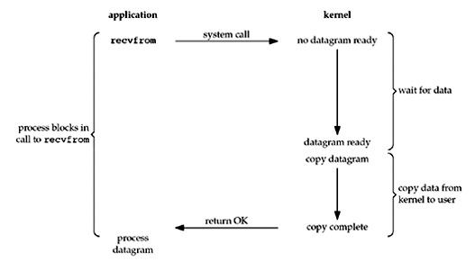
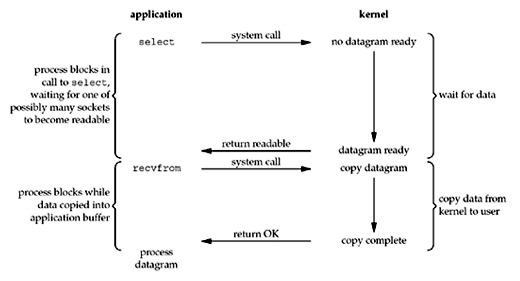

# Attack on Tornado - IO模型 🌪

<extoc></extoc>

## 前言

在开始介绍IO模型之前 , 我们需要弄清楚两组概念 **阻塞** , **非阻塞** , **同步** , **异步**

通常我们容易把这两组概念混淆 , 比如: 同步和阻塞在我们程序执行时好像是一样的? 异步和非阻塞也好像没什么区别

实际上这两组概念 , 可能从某些现象来说是有点相似 , 但实际上它们的关注点其实是不一样的 

### 同步与异步

同步和异步关注的是消息通信机制 , 也就是同步通信还是异步通信

所谓同步 , 就是在发出一个功能调用时 , 在没有得到结果之前，该调用就不会返回 . 按照这个定义，其实绝大多数函数都是同步调用 . 但是一般而言 , 我们在说同步、异步的时候 , 特指那些需要其他部件协作或者需要一定时间完成的任务

异步的概念和同步相对 , 当一个异步功能调用发出后 , 调用者不能立刻得到结果 . 当该异步功能完成后 , 通过状态、通知或回调来通知调用者 , 如果异步功能用状态来通知 , 那么调用者就需要每隔一定时间检查一次 , 效率就很低(有些初学多线程编程的人 , 总喜欢用一个循环去检查某个变量的值 , 这其实是一 种很严重的错误) . 如果是使用通知的方式 , 效率则很高 , 因为异步功能几乎不需要做额外的操作 . 至于回调函数 , 其实和通知没太多区别

### 阻塞非阻塞

阻塞和非阻塞关注的是程序在等待调用结果时的状态

阻塞调用是指调用结果返回之前，当前线程会被挂起（如遇到io操作）。函数只有在得到结果之后才会将阻塞的线程激活。有人也许会把阻塞调用和同步调用等同起来，实际上他是不同的。对于同步调用来说，很多时候当前线程还是激活的，只是从逻辑上当前函数没有返回而已

非阻塞和阻塞的概念相对应，指在不能立刻得到结果之前也会立刻返回，同时该函数不会阻塞当前线程

弄清楚这两组概念我们才能更好的去理解接下来的IO模型

在I/O流程中 , 一般可以分为两个阶段 : 

1. 数据准备阶段 , 这个阶段需要等待接收网络数据 , 当数据包到达时 , 内核会将数据包拷贝到内核缓冲区
2. 数据拷贝阶段 , 这个阶段数据包会从内核缓冲区复制到我们的应用程序缓冲区

I/O模型的差异就来自于在这两个阶段上 , 不同的I/O模型有会不同的表现

## 阻塞IO

在Linux中 , 默认情况下所有的 `socket` 都是阻塞的 , 流程如上图

当用户进程调用了 `recvfrom` 这个系统调用时 , `kernel` 就进入了第一个阶段 , 这个阶段整个进程会被阻塞 , `kernel` 等到数据准备好了之后 , 就会将数据从 `kernel` 拷贝到用户内存 , 然后 `kernel` 返回结果 , 用户进程才解除阻塞状态 , 继续执行

**所以 , 阻塞IO的特点就是在IO执行的两个阶段用户进程都被阻塞了**

## 非阻塞IO

很明显 , 阻塞IO对CPU是一种极大的浪费 , 大部分时间用户进程都是阻塞的

在非阻塞IO中 , 我们可以将 `socket` 设置成非阻塞 , 而用户进程在调用 `recvfrom` 时 , 如果数据没有准备好 , 那么直接返回一个 `error` , 这样用户进程就知道数据还没有准备好 , 于是它可以再次发送 `recvfrom` 系统调用 , 直到数据准备完成 , 这个时候用户进程阻塞 , `kernel` 开始拷贝数据到用户程序缓冲区 , 拷贝完成之后解除阻塞

**所以 , 非阻塞IO , 用户在数据准备阶段会不断的轮询 `kernel` , 这个过程是不会阻塞的 , 但是在数据拷贝阶段 `recvfrom` 依然是阻塞的**

虽然非阻塞IO模型在第一阶段不会阻塞了 , 但是大量的 `recvfrom` 系统调用会大幅度提高 CPU 的暂用率 , 且可能会有很多无效的 `recvfrom` , 所以非阻塞IO模型一般不被推荐

## IO多路复用

在IO多路复用中 , 我们在调用 `recvfrom` 之前 , 先调用 `select` , `select` 会不断轮询所以的 `socket` (`socket` 会被设置成 `nonblocking` ) , 直到 `select` 中某个 `socket` 有数据才返回 , 否则将会一直阻塞

用户进程拿到可读的 `socket` 时 , 此时再去调用 `recvfrom` 将数据复制到应用程序缓冲区

**所以 , IO多路复用的特点就是提高了 `recvfrom` 的效率 , 只有当数据准备好时才会去调用 , 不过IO多路复用多出了一个 `select` 系统调用**

IO多路复用的具体实现有 :`select` , `poll` , `epoll` , `kqueue` 等等

## 信号驱动IO

我们知道在IO多路复用中 , `select` 还是会阻塞用户进程 , 而在信号驱动IO中 , 首先开启套接字的信号驱动功能 , 然后使用 `sigaction` 系统调用绑定信号处理程序 , 这个系统调用是立即返回的 

当数据准备好时 , 内核会向用户进程发送 `SIGIO` 信号 , 应用进程在接收到信号之后再调用 `recvfrom` 将数据从内核复制到用户程序缓冲区中

**所以 , 信号驱动IO的特点就是在IO多路复用的基础上 , 把 `select` 这一个阻塞调用也去除了 , 第一阶段完全非阻塞 , 当然第二阶段还是阻塞的**

## 异步IO

在上面我们分析了阻塞IO , 非阻塞IO , IO多路复用 , 信号驱动IO , 实际上都没有解决第二阶段的阻塞问题

也就是说阻塞IO , 非阻塞IO , IO多路复用 , 信号驱动IO 都属于同步IO

那就明了了 , 异步IO就是实现两阶段全部非阻塞

当请求进程发起读操作时 , 内核会立刻返回 , 不会阻塞请求进程 , 内核在数据准备完成后 , 会将数据拷贝到用户程序缓冲区 , 当所有这些工作全部完成 , 内核会通知请求进程 , IO操作已完成

**所以 , 异步IO的特点就是信号驱动IO是通知用户进程现在可以开始拷贝了 , 而异步IO则是通知用户进程已经拷贝完成了 , 实现真正的两阶段非阻塞**

异步IO好是好 , 但是当前Linux对异步IO的支持并不成熟 , 更多的还是基于IO多路复用去达到我们的用户层异步

## IO模型比较

最后 , 这个图就非常的简单了

后续我们来通过代码去实现这些IO模型